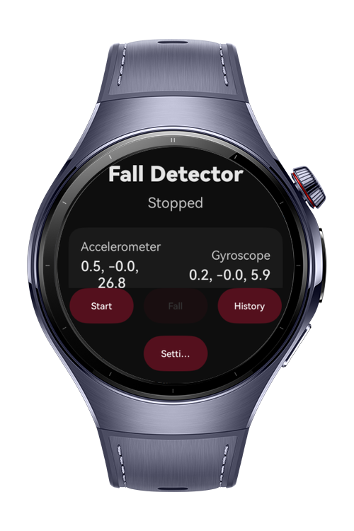
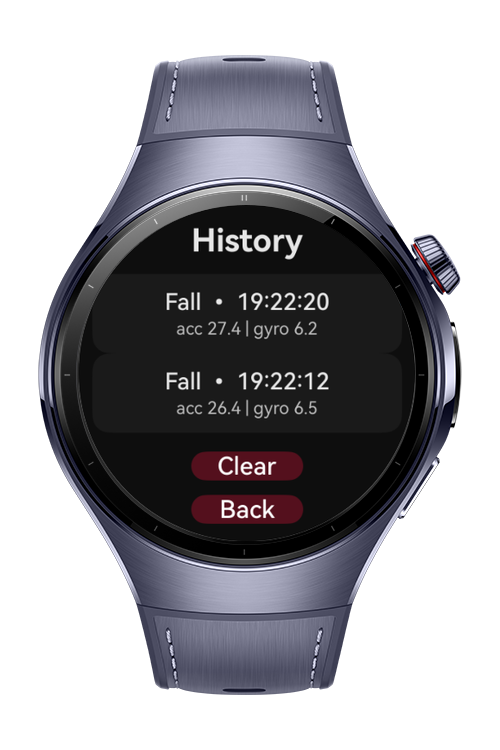
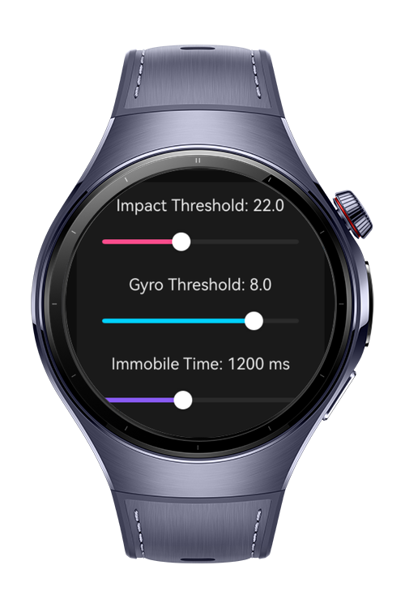
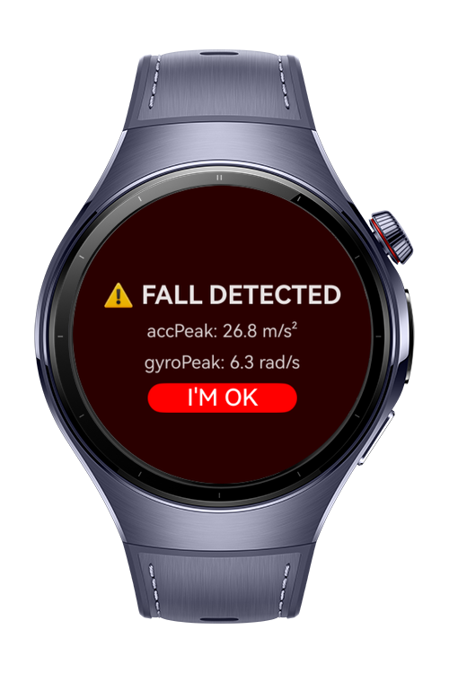

> **Note:** To access all shared projects, get information about environment setup, and view other guides, please visit [Explore-In-HMOS-Wearable Index](https://github.com/Explore-In-HMOS-Wearable/hmos-index).

# Fall Detector
**Fall Detector** is a HarmonyOS  application that monitors accelerometer and gyroscope data to detect potential fall events.
It provides real-time sensor monitoring, configurable detection thresholds, a mock simulation mode for testing, and a fall history log.
# Preview
<div>
 
   
   
  
</div>

# Use Cases

- Start / Stop Fall Monitoring

- View live sensor values (Accelerometer / Gyroscope)
- Detect falls and show an alert screen
- Review past fall events
- Clear history events
- Adjust detection sensitivity from Settings
# Technology
## Stack
- **Languages:** ArkTS
- **UI:** ArkUI Navigation (`NavPathStack`, `Navigation`, `NavDestination`)
- **Sensors:** `@kit.SensorServiceKit` (Accelerometer, Gyroscope)
- **Storage:** `AppStorage` and `PersistentStorage` (config, prefs, history)
- **Tools/IDE:** DevEco Studio **6.0.0**
- **SDK:** HarmonyOS SDK **5.1.0.54**
- **Libraries:** Built-in kits only

# Directory Structure
```
entry/
└── src/
└── main/
├── ets/
│ ├── pages/
│ │ ├── Index.ets
│ │ ├── HomePage.ets
│ │ ├── SettingsPage.ets
│ │ ├── HistoryPage.ets
│ │ └── AlertPage.ets
│ ├── services/
│ │ ├── SensorService.ets
│ │ └── DetectionEngine.ets
│ └── store/
│ └── FallStore.ets
└── resources/
└── base/
└── profile/
├── main_pages.json
└── route_map.json
```

# Constraints and Restrictions
## Supported Device
- Huawei Watch 5
## App Limits
On-device processing (no backend)
- Requires sensor permissions:
    - `ohos.permission.ACCELEROMETER`
    - `ohos.permission.GYROSCOPE`
# License
**Fall Detector** is distributed under the terms of the MIT License  
See the [LICENSE](./LICENSE) for more information.
