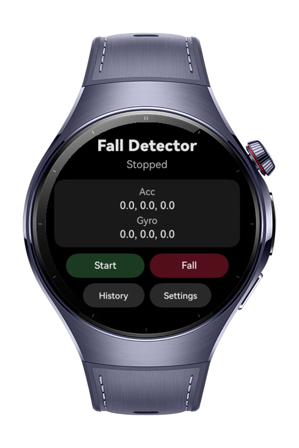
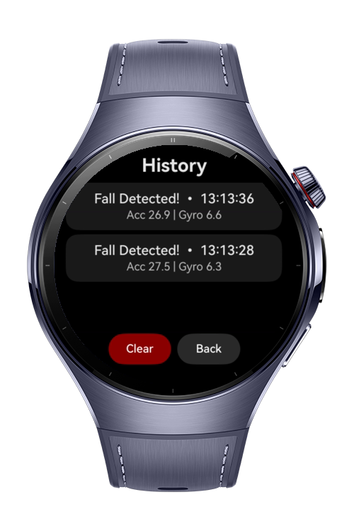
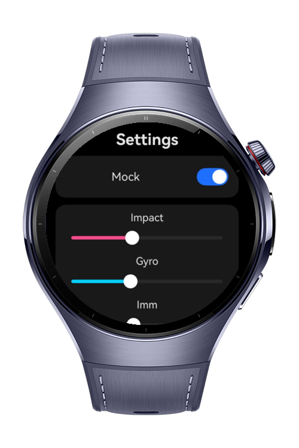
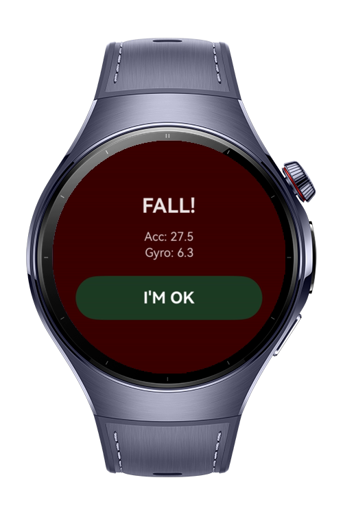

# Fall Detector
**Fall Detector** is a HarmonyOS application that monitors accelerometer and gyroscope data to detect potential fall events.
It provides real-time sensor monitoring, configurable detection thresholds, a mock simulation mode for testing, and a fall history log.

- **Modern Storage Architecture**: Uses ArkData (`relationalStore` for events, `Preferences` for config).
- **Internationalization (i18n)**: Full support for English and Turkish languages.
- **Wearable Native Integration**:
    - **Digital Crown**: Smooth scrolling support.
    - **Haptic Feedback**: Tactile feedback for clicks, state changes, and emergency alerts.
- **Optimized UI**: Tailored for circular and small-form-factor wearable displays (220x220).
- **Battery Efficient**: Balanced sensor polling and strict lifecycle management.

# Preview
<div>
  
  
  
  
</div>

# Use Cases
- Start / Stop Fall Monitoring
- View live sensor values (Accelerometer / Gyroscope)
- Detect falls and show an alert screen
- Review past fall events
- Clear history events
- Adjust detection sensitivity from Settings

# Technology
## Stack
- **Languages:** ArkTS
- **UI:** ArkUI Navigation (`NavPathStack`, `Navigation`, `NavDestination`)
- **Sensors:** `@kit.SensorServiceKit` (Accelerometer, Gyroscope)
- **Haptics:** `@kit.SensorServiceKit` (Vibrator)
- **Storage:** ArkData (`relationalStore`, `Preferences`)
- **Localization:** Localization Kit (EN, TR)
- **Tools/IDE:** DevEco Studio **6.0.0**
- **SDK:** HarmonyOS SDK **6.0.0**
- **Libraries:** Built-in kits only

# Directory Structure
```
entry/
└── src/
└── main/
├── ets/
│ ├── pages/
│ │ ├── Index.ets
│ │ ├── HomePage.ets
│ │ ├── SettingsPage.ets
│ │ ├── HistoryPage.ets
│ │ └── AlertPage.ets
│ ├── services/
│ │ ├── SensorService.ets
│ │ ├── HapticService.ets
│ │ └── DetectionEngine.ets
│ └── store/
│ └── FallStore.ets
└── resources/
├── base/
├── en_US/
└── tr_TR/
```

# Constraints and Restrictions
## Supported Device
- Huawei Watch 5 / Universal Wearable (Circular & Rectangular)
## App Limits
- On-device processing (no backend)
- Requires sensor permissions:
    - `ohos.permission.ACCELEROMETER`
    - `ohos.permission.GYROSCOPE`

# License
**Fall Detector** is distributed under the terms of the MIT License
See the [LICENSE](./LICENSE) for more information.
